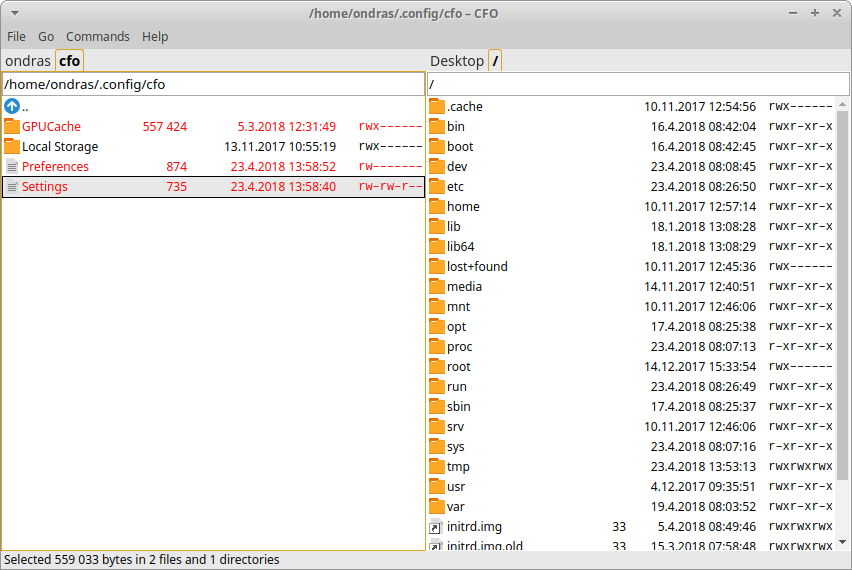

# CFO

[](https://travis-ci.com/ondras/cfo)



CFO is a traditional two-pane file manager. It is aimed at power users, built to be controlled (almost exclusively) with keyboard shortcuts (most notably F-keys).

CFO shall become a modernized version of [Fire Commander](https://addons.mozilla.org/en-us/firefox/addon/fire-commander/). Fire Commander is built using XUL/XPCOM, a tech stack that is becoming obsolete. Electron-based CFO will continue its mission.

CFO is using [Numix icons](https://github.com/numixproject/numix-icon-theme) and [Faenza icons](https://github.com/shlinux/faenza-icon-theme).

## Feature + Task list

- Directory listing
  - [X] Tabs
  - [X] Statusbar
  - [X] Filetype icons
  - [X] Symlink icons
  - [X] Quick search
  - [X] Fast rename
- File operations
  - [X] Create file/directory
  - [X] Scan
  - [X] Delete
  - [X] Copy
  - [X] Move
  - [ ] Search
- Viewers
  - [X] Image
    - [ ] EXIF
    - [X] Navigation
  - [X] Text
  - [X] Audio/Video
- File systems
  - [X] Local
  - [ ] ZIP
  - [ ] ISO 9660
  - [ ] Windows drives
  - [X] Favorites
  - [ ] SQLite
  - [ ] Wifi?
- Miscellaneous
  - [X] Menu
  - [X] No toolbar
  - [X] Configuration
  - [X] Persistence
  - [X] Selection
  - [X] Clipboard support
  - [ ] Logo / App icon
  - [X] Permissions font

## Running

```bash
$ npm install
$ npm start
```

## Building

```bash
$ npm install
$ make
```

## Contributing

This project is looking for contributors. Please open an issue describing your intentions before working on a PR.
